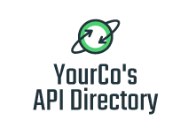

![banner]

[![APIs in collection][numApis-image]][apisDir-link]
[![OpenAPI definitions][numSpecs-image]][apisDir-link]
[![Endpoints][endpoints-image]][apisDir-link]
[![Fixes][fixes-image]][apisDir-link]
[![Providers][providers-image]][apisDir-link]
[![Drivers][drivers-image]][apisDir-link]

[![Chat on Slack][slack-image]][slack-link]

[![Share on Twitter][twitter-image]][twitter-link]
[![Follow on Twitter][twitterFollow-image]][twitterFollow-link]
  

Directory of API definitions in [OpenAPI(fka Swagger)](https://openapis.org) [2.0](https://github.com/OAI/OpenAPI-Specification/blob/main/versions/2.0.md) and [3.x](https://github.com/OAI/OpenAPI-Specification/blob/main/versions/3.0.3.md) formats. 
API access to collection: [Go!][apiDoc-link] - We also have RSS feeds for [added](https://api.apis.guru/v2/added.rss) and [updated](http://api.apis.guru/v2/list.rss) APIs.

[![Add API][addAPI-image]][addAPI-link]

Our goal is to create the most comprehensive, standards-compliant and up-to-date directory of machine-readable API definitions, with the following principles:
- Open source, community driven project.
- Only publicly available APIs (free or paid).
- Anyone can add or change an API, not only API owners.
- All data can be accessed through a [REST API][apiDoc-link].

If you want to reference this project and you need an icon or even a banner, check our [branding guide](https://github.com/APIs-guru/branding).

The project was started by [Ivan Goncharov](https://github.com/IvanGoncharov) of APIs.guru, it is now maintained by [Mike Ralphson](https://github.com/MikeRalphson) of [Mermade Software](https://github.com/mermade). Check out our other [OpenAPI-related projects](https://github.com/search?q=org%3AMermade+openapi).

APIs.guru provide services and consultancy around the GraphQL and OpenAPI specifications and APIs in general.
You can contact us at founders@apis.guru / mike.ralphson@gmail.com

The OpenAPI Directory is sponsored by [Speakeasy](https://www.speakeasyapi.dev/?utm_source=apigurus+repo&utm_medium=github+sponsorship) - Your API: Enterprise ready in a click.

What does APIs.guru do?
--------------------------
* Filter out private and non-reliable APIs
* [Convert](https://github.com/Mermade/oas-kit) non-OpenAPI formats into OpenAPI 3.x
* Fix mistakes, ~80% of definitions have some
* Add additional data, like: logo, categories, …
* Update definitions on at least a weekly basis

API definition acceptance criteria
----------------------------------
* Public - anyone can access it as long as they follow some clearly defined steps (subscribe, pay fees, etc.).
* Persistent - API is made with long-lived goal, and not for a particular event (conference, hackathon, etc.).
* Useful - API should provide useful functionality not only for its owner.

Update procedure
--------------------------
All definitions are automatically updated from their original source.
You can see this in the `x-origin` property within each [openapi.yaml](https://github.com/APIs-guru/openapi-directory/search?utf8=%E2%9C%93&q=x-origin+filename%3Aopenapi.yaml) or [swagger.yaml](https://github.com/APIs-guru/openapi-directory/search?utf8=%E2%9C%93&q=x-origin+filename%3Aswagger.yaml) file.
We run our update script at least weekly and automatically revalidate before committing.
If you see some APIs are not updated for more than 2 weeks please open [an issue](https://github.com/APIs-guru/openapi-directory/issues/new).

[@seriousme](https://github.com/seriousme) kindly runs a backup validation process based on the official OpenAPI-Specification [JSON Schemas](https://github.com/OAI/OpenAPI-Specification/tree/main/schemas) [here](https://github.com/seriousme/openapi-schema-validator/blob/master/test/realworld/failed.md#results-of-real-world-testing).

Own-Label API Directory
-----------------------

**Do you want an 'own-label' or internal version of the OpenAPI Directory to create your own marketplace or keep track and document both your internal APIs and the external API definitions your organisation depends on? If so contact us now!**

Existing integrations
--------------------------

 - [HTTP Toolkit](https://httptoolkit.tech/) **Beautiful & open-source tools to debug, test and develop with HTTP(S)**
 - [OpenAPI-Directory-JS](https://github.com/httptoolkit/openapi-directory-js) - The OpenAPI directory precompiled & indexed for JS usage & searching
 - [Apideck](https://apideck.com) - Faster data integration through Unified APIs
 - [Microsoft Kiota](https://microsoft.github.io/kiota/) - Generate an API client to call any OpenAPI described API
 - [API Tracker](https://apitracker.io/) - Aggregates 14,000+ APIs, SDKs, API specifications, integrations and DX profiles. It aims to help developers access the information they need to integrate APIs faster
 - [API Watch](https://www.apiwatch.io) - Keep track of the APIs you use
 - https://pipedream.com/ - The integration platform built for developers
 - https://any-api.com - Documentation and Test Consoles for Public APIs
 - https://datafire.io - Allows you to process and transfer data between APIs, databases, and more
 - [https://sdks.io](https://sdks.io/Search/FindSDKs?Bridge=APIs.guru) - Explore Automatically Generated SDKs
 - [https://cenit.io](https://cenit.io/directory?spec=swagger) - Data integration platform
 - [commandcar](https://github.com/tikalk/commandcar#installing-from-api-models) - Curl on steroids
 - [Material Swagger UI Hub](https://darosh.github.io/angular-swagger-ui-material/hub/) - testing and exploring hub for Material Swagger UI demo
 - [Paw](https://paw.cloud/) - HTTP client for Mac - You can import definitions and directly play with the APIs, [see how](https://paw.cloud/docs/examples/search-apis)
 - [Bitscoop](https://bitscoop.com/) - A better way to create and maintain integrations
 - [WinSwag](https://github.com/SvenEV/WinSwag) - A UWP app for loading Swagger definitions and exploring REST APIs
 - [ReadMe.io](https://preview.readme.io) - Beautiful, personalized, interactive developer hubs
 - [Velosimo](https://connect.velosimo.io/open_api_directory) - Integration platform for eGovernment
 - [Mockoon](https://mockoon.com/mock-samples/category/all/) - API mock samples for your project

Also used as test suite in the following projects:
 - [Speakeasy](https://www.speakeasyapi.dev/?utm_source=apigurus+repo&utm_medium=github+sponsorship) - **Generate SDKs Now. Gives your users the DevEx that makes API integrations easy**
 - [ReDoc](https://github.com/Redocly/redoc) - OpenAPI-generated API Reference Documentation
 - [swagger-parser](https://github.com/BigstickCarpet/swagger-parser) - OpenAPI parser and validator for Node and browsers
 - [OpenAPI-schema-validator](https://github.com/seriousme/openapi-schema-validator) - OpenApi schema validation for OpenApi versions v2, v3.0.x and v3.1.x
 - [SwaggerProvider](https://github.com/sergey-tihon/SwaggerProvider) - F# Type Provider for Swagger
 - [ardoq-swagger-addon](https://github.com/ardoq/ardoq-swagger-addon) - Ardoq OpenAPI addon
 - [swagvali](https://github.com/subeeshcbabu/swagvali/) - Module to build validators for OpenAPI Request parameters and Response objects
 - [swagger-search](https://github.com/IG-Group/swagger-search) - An application that collects and indexes swagger docs from your microservices architecture

Integration with 3rd-party services
--------------------------
We discourage you from using Github RAW links or Git directly, the repository structure may change in the future.
Instead, we strongly recommend you to use our [REST API][apiDoc-link].

Licenses
--------------------------
All API definitions contributed to project by authors are covered by the [CC01.0](https://creativecommons.org/publicdomain/zero/1.0/) license. 
All API definitions acquired from public sources under the [Fair use](http://en.wikipedia.org/wiki/Fair_use) principle.

Definition sources
--------------------------
Some definitions are taken from Open Source projects:
 - [darklynx/swagger-api-collection](https://github.com/darklynx/swagger-api-collection) - OpenAPI description for Instagram API
 - [Mermade/bbcapis](https://github.com/Mermade/bbcapis) - OpenAPI definitions for the BBC Nitro and iBL APIs
 - [amardeshbd/medium-api-specification](https://github.com/amardeshbd/medium-api-specification) - OpenAPI 2.0 description for Medium API
 - [faragorn/open-api-specs](https://github.com/faragorn/open-api-specs) - OpenAPI definition for the Giphy API

[banner]: https://apis.guru/branding/banner.svg "APIs.guru"
[twitter-image]: https://img.shields.io/twitter/url/http/APIs.guru.svg?style=social
[twitter-link]: https://twitter.com/intent/tweet?text=http%3A%2F%2FAPIs.guru%20-%20Wikipedia%20for%20%23Web%20%23APIs%20by%20@APIs_guru%20pic.twitter.com/UhlhbMw1NP
[twitterFollow-image]: https://img.shields.io/twitter/follow/APIs_guru.svg?style=social
[twitterFollow-link]: https://twitter.com/intent/follow?screen_name=APIs_guru
[slack-image]: https://img.shields.io/badge/Slack-APIs_Working_Group-brightgreen
[slack-link]: https://join.slack.com/t/mermade/shared_invite/zt-g78g7xir-MLE_CTCcXCdfJfG3CJe9qA
[numApis-image]: https://api.apis.guru/badges/apis_in_collection.svg
[numSpecs-image]: https://api.apis.guru/badges/openapi_specs.svg
[endpoints-image]: https://api.apis.guru/badges/endpoints.svg
[fixes-image]: https://api.apis.guru/badges/fixes.svg
[providers-image]: https://api.apis.guru/badges/providers.svg
[drivers-image]: https://api.apis.guru/badges/drivers.svg
[apisDir-link]: ./APIs
[addAPI-image]: https://cloud.githubusercontent.com/assets/8336157/15861614/7e31511a-2cd5-11e6-8b79-38ad0f61e598.png
[addAPI-link]: https://apis.guru/add-api/
[apiDoc-link]: https://apis.guru/api-doc/

## Contributors

This project exists thanks to all the people who [contribute](CONTRIBUTING.md).

## Asynchronous APIs

See also [AsyncAPI-Directory](https://apis.guru/asyncapi-directory/APIs/)

## Backers

Thank you to all our backers! 🙏 [Become a backer](https://opencollective.com/openapi-directory#backer).

## Sponsors

Support this project by becoming a sponsor. Your logo will show up here with a link to your website. [Become a sponsor](https://opencollective.com/openapi-directory#sponsor).

## Partners

Support this project by becoming a partner. Your logo will be displayed prominently in this project and we will work with you to publicise and showcase your projects. [Become a partner](https://opencollective.com/openapi-directory#partner).
